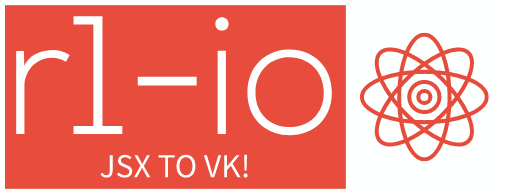

<div align="center">
    
</div>

<div align="center">
		<a href="#guide">Guide</a>
  <span> • </span>
		<a href="#install">Install</a>
  <span> • </span>
		<a href="#features">Features</a>
  <p></p>
</div>

<div align="center">

# Guide

</div>

1.  Create context of app

```typescript
enum Menus {
  Main = "main",
  Settings = "settings",
}

interface User {
  name: string;
  selectedMenu: Menus;
}

export interface BotContext {
  user: User;
}
```

<hr>

2.  Create actions you will use

```typescript
const gotoMenuAction = createParametarizedAction<BotContext, Menus>(
  "goto menu",
  (menu, { send }, { user }) => {
    user.selectedMenu = menu;
    send(`Welcome to ${menu}`);
  }
);

const setRandomUsername = createAction<BotContext>(
  "set random username",
  ({ send }, { user }) => {
    const getRandomInt = (max: number) => Math.floor(Math.random() * max);
    const randomName = ["Fish", "Sticks", "Kanye West", "Toivo", "SunBoy"];
    user.name = randomName[getRandomInt(4)];
    send(`Your name is ${user.name}`);
  }
);
```

<hr>

3.  Create menu constructors

```tsx
const SettingsMenu: R1IO.FC<BotContext> = async () => (
  <menu>
    <row>
      <button label={`Get random username`} onClick={setRandomUsername()} />
    </row>
    <row>
      <button onClick={gotoMenuAction(Menus.Settings)}>Goto main menu</button>
    </row>
  </menu>
);

const MainMenu: R1IO.FC<BotContext> = ({ user }) => (
  <menu>
    <row>
      <button label={`Hello ${user.name}`} />
    </row>
    <row>
      <button onClick={gotoMenuAction(Menus.Settings)}>
        Goto settings menu
      </button>
    </row>
  </menu>
);
```

<hr>

4.  Create router & your context filler (middleware)

```typescript
const user: User = {
  name: "Dmitriy",
  selectedMenu: Menus.Main,
};

const router = createBuilder<BotContext, Menus>(
  {
    [Menus.Main]: { build: MainMenu },
    [Menus.Settings]: { build: SettingsMenu },
  },
  ({ user }) => user.selectedMenu
);

export const RootMiddleware = createMiddleware(router, async () => ({ user }));
```

<hr>

<div align="center">

# Install

</div>

1.  Add package to your project

```bash
yarn add r1-io
```

or

```bash
npm i r1-io
```

<hr>

2.  Add vk-io to your project (only 4.4.0 tested)

```bash
yarn add vk-io@4.4.0
```

or

```bash
npm i r1-io@4.4.0
```

<hr>

3.  Add this lines to your `tsconfig.json`

```json
{
  "compilerOptions": {
    "jsx": "react",
    "jsxFactory": "R1IO.createElement",
    "jsxFragmentFactory": "R1IO.Fragment"
  }
}
```

<hr>

<div align="center">

# Features

</div>

1.  React components instead of keyboard builder

```tsx
const MainMenu: R1IO.FC<BotContext> = ({ user }) => (
  <menu>
    <row>
      <button label={`Hello ${user.name}`} />
    </row>
    <row>
      <button onClick={gotoMenuAction(Menus.Settings)}>
        Goto settings menu
      </button>
    </row>
  </menu>
);
```

<hr>

2.  Async react components

```tsx
const MainMenu: R1IO.FC<BotContext> = async ({ user }) => {
  await delay(2000);
  <menu>
    <row>
      <button label={`Hello ${user.name}`} />
    </row>
  </menu>;
};
```

<hr>

3.  User based actions

<hr>
